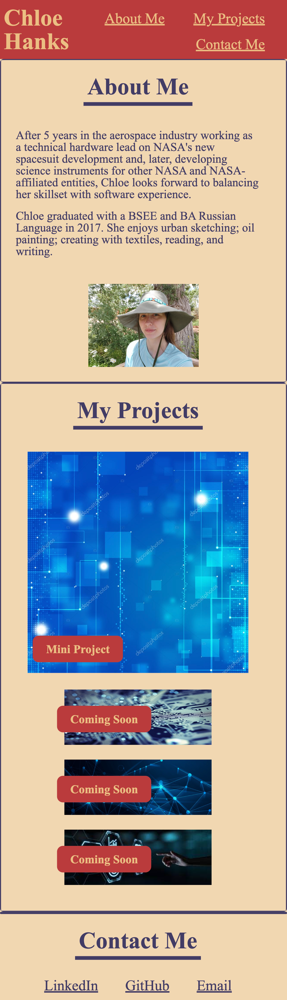
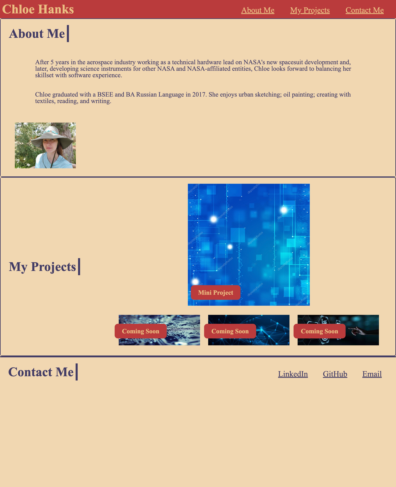
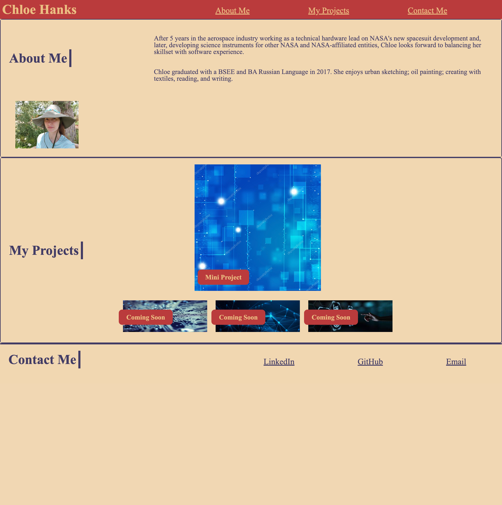

# wk2 - Create Portfolio

## Description
The purpose of this project is to create a viewport-responsive webpage that displays the author's portfolio. When the user clicks on any of the navigation links in the header, the webpage will bring the user to the selected section. 

The portfolio includes a biographical section, which includes a recent picture and brief bio of the author; a project section to showcase a sample of projects, with clickable images to redirect to said projects; and a contact section with links to contact the author.

When the website is opened (or when source code is opened in default browser), the following page should appear as shown in the images below, based on the viewport used. 

> **Note 1**: This layout is designed for desktop viewing, so some of the elements may appear differently on individuals' devices.

> **Note 2**: CSS includes code that is commented out that otherwise shows a boarder around each flex item to aid in troubleshooting.

## Installation

N/A

## Usage

Open the webpage using the [live URL link](https://chloeeh.github.io/hanks-portfolio/) and use Chrome Developer Tools to inspect the source code. The code is commented and includes accessibility tags compared to the original code that used generic division tags.

## Credits

Resources used:
1) Bootcamp Pre-work Modules
2) Bootcamp 02-Advanced-CSS Activities
3) [Learn Flexbox in 15 Minutes](https://www.youtube.com/watch?v=fYq5PXgSsbE)
4) [How to place text on image using HTML and CSS?](https://www.geeksforgeeks.org/how-to-place-text-on-image-using-html-and-css/)
5) [Basic Markdown Syntax](https://www.markdownguide.org/basic-syntax/)

## License

Please refer to the LICENSE in the repository.